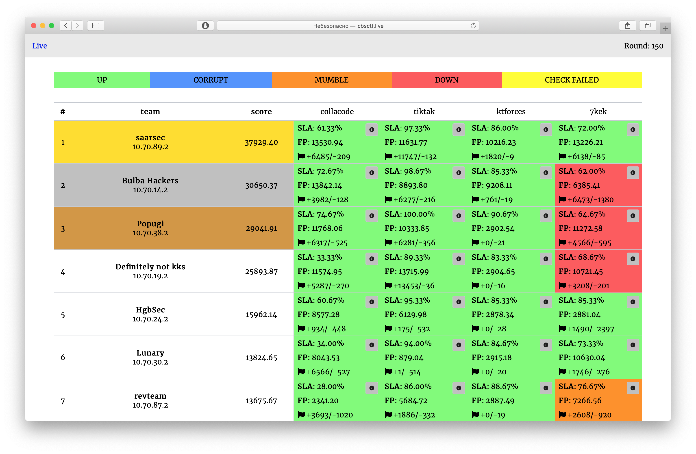

# Attack-Defence training by C4T BuT S4D

Sources of services, checkers and sploits from 2nd February 2020 training.

## Results

[Full scoreboard](scoreboard/full.png)

## Services

| Service | Lang | Checker | Sploits | Author |
|--------|------|-------|---------|-------|
| **[collacode](services/collacode/)** | Python | [Checker](checkers/collacode/) | [Sploits](sploits/collacode/) | [@pomo_mondreganto](https://github.com/pomo-mondreganto) & [@kekov](https://github.com/xmikasax) |
| **[tiktak](services/tiktak/)** | Golang | [Checker](checkers/tiktak/) | [Sploits](sploits/tiktak/) | [@jnovikov](https://github.com/jnovikov) |
| **[ktforces](services/ktforces/)** | VueJs | [Checker](checkers/ktforces/) | [Sploits](sploits/ktforces/) | [@kekov](https://github.com/xmikasax) & [@pomo_mondreganto](https://github.com/pomo-mondreganto) |
| **[7kek](services/7kek/)** | Php | [Checker](checkers/7kek/) | [Sploits](sploits/7kek/) | [@alagunto](https://github.com/alagunto) |

## Image

- Alpine in Docker

## Infrastructure

- DevOps: [@pomo_mondreganto](https://github.com/pomo-mondreganto)
- Checksystem: [ForcAD](https://github.com/pomo-mondreganto/ForcAD)

## Writeups

Coming...
